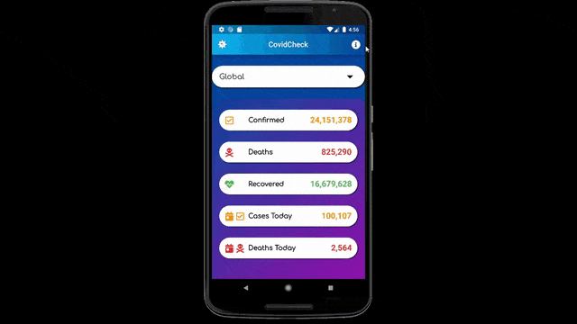

# Description

Android app built with Dart, in Android Studio, to display COVID-19 stats, both globally and per country. The user picks a location from the dropdown button at the top. The statistics for that location or globally are retrieved using an API called NovelCOVID. 

After taking an online course on Dart, I wanted to apply that knowledge and reinforce it in my mind. My first thought was using an API to gather data. Since I was planning the app in the middle of the COVID-19 pandemic, I figured it was an appropiate topic to base the app on.

# Stats Shown

- Confirmed Cases
- Deaths
- Recovered 
- Cases Today
- Deaths Today

# Demo
Video recorded in mid-June 2020

